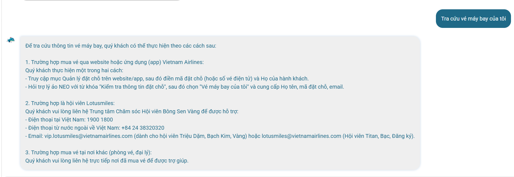

# Workshop — Mổ App AI Thật

**Thời gian:** 35-45 phút  
**Hình thức:** cá nhân trước, chia sẻ theo nhóm sau  
**Output:** finding note + sketch `as-is / to-be`

Mục tiêu không phải chấm "UI đẹp hay xấu". Mục tiêu là dùng sản phẩm thật như một bài needfinding: tìm chỗ product gãy trong workflow thật, rồi viết finding đó thành quyết định product.

## 1. Chọn một sản phẩm để dùng thử

| Sản phẩm | AI feature | Cách truy cập |
|---|---|---|
| MoMo — Moni | Trợ thủ tài chính, phân tích chi tiêu, chatbot | App MoMo |
| Vietnam Airlines — NEO | Chatbot hỗ trợ vé, hành lý, khiếu nại | Website/Zalo VNA |
| V-App — V-AI | Trợ lý voice/text, gợi ý theo ngữ cảnh | App V-App |

**Sản phẩm chọn:** Vietnam Airlines — NEO

## 2. Dùng thử: promise vs reality

Ghi nhanh:

- **Product hứa gì?** "NEO là ứng dụng Chatbot được vận hành bởi trí tuệ nhân tạo cho phép Quý khách tương tác với Vietnam Airlines thông qua website, ứng dụng di động và một số kênh hỗ trợ chính thức khác của Vietnam Airlines." — NEO hứa hỗ trợ khách hàng 24/7, trả lời tự động các thắc mắc về vé, hành lý, khiếu nại.
- **User nào được hứa sẽ được giúp?** Hành khách của Vietnam Airlines, đặc biệt là người cần tra cứu thông tin chuyến bay, thủ tục, chính sách vé ngoài giờ hành chính.
- **Kỳ vọng AI làm được task nào?** Trả lời chính xác thông tin vé, chuyến bay, hành lý; hỗ trợ xử lý tình huống cá nhân (đổi vé, hoàn vé, khiếu nại); định tuyến đúng phòng ban khi cần support người thật.
- **Điểm gãy xuất hiện ở đâu?** Khi user hỏi tình huống cá nhân — NEO chỉ trả lời chung chung hoặc chuyển tiếp, không giải quyết được triệt để.

### Evidence cụ thể

| Loại | Nội dung |
|---|---|
| **Prompt/input đã thử** | "Tôi muốn đổi vé từ Hà Nội đi TP.HCM từ ngày 10/06 sang 15/06, tôi cần làm gì?" |
| **Hành vi quan sát** | NEO trả về hướng dẫn chung về chính sách đổi vé (link trang web), không hỏi mã đặt chỗ hay thông tin cụ thể để kiểm tra tính khả thi. |
| **Quote từ app** | "Vui lòng truy cập website Vietnam Airlines để biết thêm thông tin chi tiết về chính sách đổi vé hoặc liên hệ tổng đài 19001100 để được hỗ trợ." |
| **Hành vi quan sát 2** | Khi hỏi "chuyến bay VN1234 từ Đà Nẵng đi Hà Nội ngày mai có đúng giờ không?", NEO trả lời chung về cách check-in online, không trả lời trạng thái chuyến bay. |

Hình ảnh chứng minh về tính chung chung 

## 3. Vẽ 4 paths

### Happy Path (khi AI đúng)
```
User: "Hành lý xách tay tối đa bao nhiêu kg?"
       │
       ▼
NEO hiểu đúng intent ──→ Trả lời: "7kg Phổ thông, 12kg Thương gia"
       │
       ▼
User: hài lòng ✓
```

### Low-confidence Path (khi AI không chắc) — NEO chưa có
```
User: "Tôi muốn đổi vé từ HN đi HCM, ngày 10/06 sang 15/06"
       │
       ▼
NEO: không xác định được chính xác
       │
       ├── Hiện tại: trả lời chung + link FAQ + gợi ý gọi tổng đài ✗
       │
       └── Nên có: hỏi lại "Mã đặt chỗ của bạn là gì?" + "Bạn đi hạng vé nào?"
                      │
                      ▼
                    Trả lời cá nhân hóa hoặc chuyển support kèm context
```

### Failure Path (khi AI sai)
```
User: "Chuyến bay VN1234 ngày mai có đúng giờ không?"
       │
       ▼
NEO: "Vui lòng truy cập web hoặc liên hệ tổng đài để biết thông tin"
       │
       ▼
User: ❌ không có nút "sai rồi" / "báo cáo" / "không hữu ích"
       │
       ▼
User phải: tự search web hoặc gọi tổng đài → mất thời gian

Path này cần: Thêm feedback "Câu trả lời này có hữu ích không?"
```

### Correction Path (khi user sửa) — NEO chưa có
```
User nhận ra câu trả lời sai
       │
       ▼
User muốn sửa / báo cáo
       │
       ├── Hiện tại: không có cách nào ✗
       │
       └── Nên có: thumbs down + nhập câu trả lời đúng → log → học lại
                      │
                      ▼
                    Model cải thiện dần theo thời gian
```

**Path còn thiếu rõ rệt:** Low-confidence path (hỏi lại, xác nhận) và Correction path (sửa lỗi, feedback).

## 4. Viết finding thành quyết định

### Finding 1: Thiếu low-confidence path

```text
Khi user hỏi tình huống cá nhân (đổi vé, hoàn vé, huỷ chuyến),
AI trả lời chung chung kèm link FAQ thay vì hỏi lại thông tin cụ thể hoặc xác nhận ý định,
hậu quả là user tốn thêm 3-5 bước tự tra cứu hoặc phải gọi tổng đài.
Lỗi thuộc layer Intent + UX Recovery.
Nên sửa bằng low-confidence UX: hỏi lại mã đặt chỗ, ngày tháng, sau đó mới đưa ra câu trả lời cá nhân hóa hoặc chuyển support kèm context.
```

### Finding 2: Thiếu correction/feedback path

```text
Khi user nhận được câu trả lời sai hoặc không đúng nhu cầu,
AI không có cơ chế "câu trả lời này có hữu ích không?" hoặc "báo cáo sai sót",
hậu quả là lỗi lặp lại ở các phiên tiếp theo, không có dữ liệu để cải thiện model.
Lỗi thuộc layer Safety + UX Recovery.
Nên sửa bằng feedback widget (thumbs up/down + text input) và log dữ liệu để fine-tune.
```

### Finding 3: Mất context khi chuyển kênh

```text
Khi user yêu cầu chuyển tổng đài sau khi chat với NEO,
lịch sử chat không được chuyển cho nhân viên,
hậu quả là user phải kể lại toàn bộ câu chuyện, tăng thời gian xử lý và gây khó chịu.
Lỗi thuộc layer Data-tool + Human role.
Nên sửa bằng yêu cầu product: chuyển full chat transcript + thông tin user đã cung cấp sang nhân viên qua CRM.

```

## 5. Sketch as-is / to-be

```
AS-IS FLOW:
┌─────────────┐     ┌──────────────────┐     ┌──────────────────────┐
│ User hỏi    │ ──→ │ NEO trả lời      │ ──→ │ User không hài lòng │
│ tình huống  │     │ chung chung +    │     │                     │
│ cá nhân     │     │ link FAQ/tổng đài│     │                     │
└─────────────┘     └──────────────────┘     └──────────────────────┘
                                                    │
                                                    ▼
                                            ┌──────────────────┐
                                            │ User gọi tổng đài │
                                            │ → kể lại từ đầu   │
                                            └──────────────────┘
                                              ▲
                                              │ ĐIỂM GÃY
                                              │
                                        Mất context, mất thời gian

TO-BE FLOW:
┌─────────────┐     ┌──────────────────────┐     ┌──────────────────────┐
│ User hỏi    │ ──→ │ NEO hỏi lại thông    │ ──→ │ NEO tra cứu &        │
│ tình huống  │     │ tin: mã đặt chỗ,     │     │ trả lời cá nhân hóa  │
│ cá nhân     │     │ ngày tháng, loại vé  │     │ (hoặc chuyển kèm     │
│             │     │ (LOW-CONFIDENCE PATH) │     │ context)             │
└─────────────┘     └──────────────────────┘     └──────────────────────┘
                                                            │
                                                            ▼
                                                    ┌──────────────────────┐
                                                    │ Feedback: 👍 / 👎   │
                                                    │ + text input         │
                                                    │ (CORRECTION PATH)    │
                                                    └──────────────────────┘
                                                            │
                                                            ▼
                                                    ┌──────────────────────┐
                                                    │ Log & học lại       │
                                                    │ → cải thiện model   │
                                                    └──────────────────────┘
```

## 6. Tự kiểm trước khi nộp

- [x] Có ít nhất 1 screenshot hoặc observation cụ thể.
- [x] Có đủ 4 paths hoặc nói rõ path nào chưa có trong product.
- [x] Finding được viết thành product decision, không chỉ là nhận xét.
- [x] Sketch có as-is và to-be.
- [x] Có một câu nói rõ finding này sẽ đổi gì trong SPEC.

